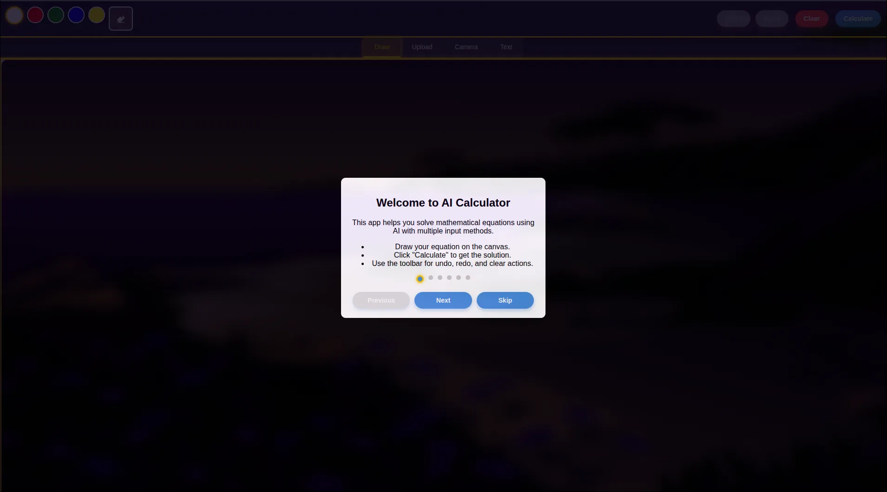
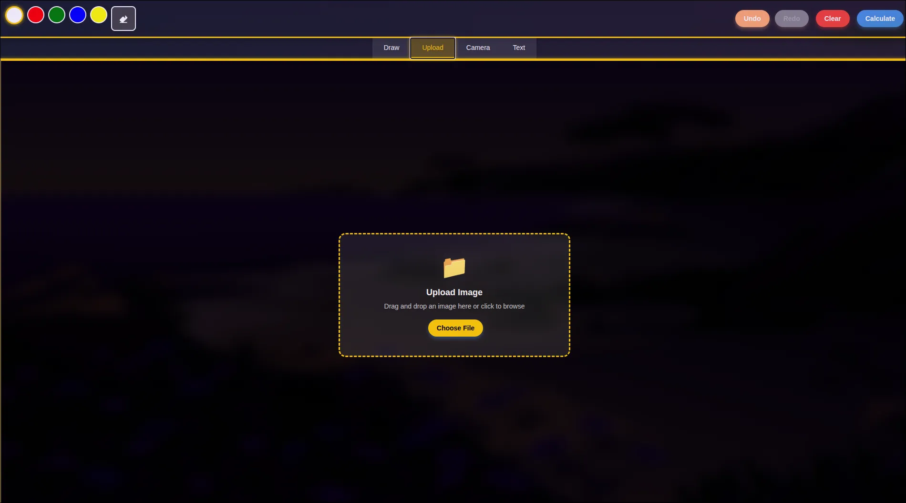
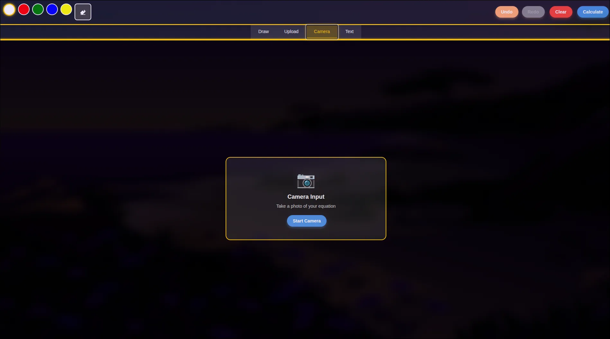
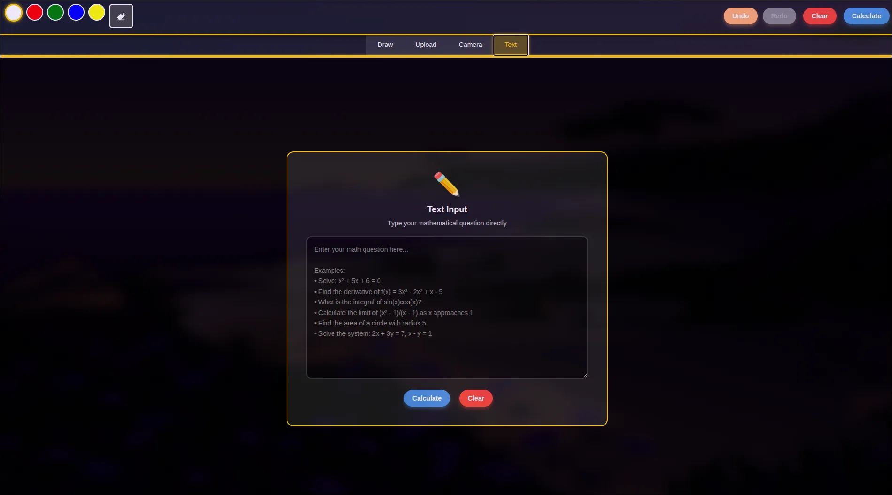
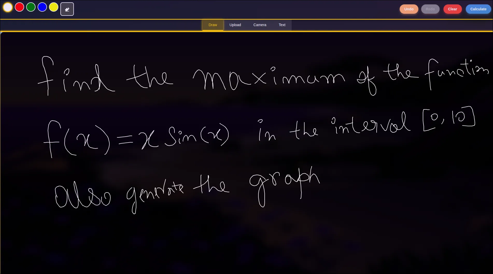

# AI Calculator

[](6. **Run the Flask application (development only):**
   ```bash
   python app.py
   ```
7. **Run in production with Gunicorn:**://opensource.org/licenses/MIT)  
A modern AI-powered calculator app built with Flask and integrated with Google's Gemini API for advanced generative capabilities. This app supports any kind of mathematical calculations and provides a sleek, user-friendly interface.

## 🚀 Features
- **AI-Powered Calculations**: Leverages Google's Gemini API for advanced generative capabilities.
- **Fallback AI Model**: Uses OpenRouter Qwen 2.5 32B Vision model automatically when Gemini API quota is exhausted.
- **Modular Backend**: The backend code is fully modularized for maintainability.
- **Dockerized Deployment**: Easily deployable using Docker and Docker Compose.
- **Visual Diagrams**: Automatically generates mathematical diagrams using matplotlib when beneficial (graphs, plots, functions, geometry, etc.).
- **User-Friendly Design**: Intuitive UI with responsive design.
- **Error Handling**: Robust mechanisms for handling invalid inputs gracefully and user-friendly error pages (404, 500).
- **Static File Serving**: Efficient static file serving using Flask's `send_from_directory`.
- **Rate Limiting**: Protects endpoints with configurable rate limits using Flask-Limiter and Redis.
6. **Fallback Logic**: If Gemini API quota is exhausted, the app automatically falls back to OpenRouter Qwen 2.5 32B Vision model for AI-powered calculations.
- **CORS Security**: Restricts cross-origin requests via environment variable configuration.
- **Logging**: Logs errors and important events for easier debugging and monitoring.
- **Production Ready**: Designed to run with Gunicorn and Redis for scalable deployments.

---

## 🖼️ Screenshots
### Onboarding


### Home Page


### Upload Image


### Camera Input


### Text Input


### Question


### Calculation Example


---

## 🛠️ Technologies Used
- **Backend**: Flask, Flask-Limiter (with Redis), Flask-CORS
- **Frontend**: HTML, CSS (Material Design principles)
- **API Integration**: Google's Gemini API
- **Diagram Generation**: matplotlib, NumPy
- **Environment Management**: Python `venv` and `dotenv`
- **Production**: Gunicorn, Redis, Nginx (recommended)

---

## 📂 Project Structure
```plaintext
AI_Calculator/
├── app.py          # Main Flask application
├── static/         # Static files (favicon, index.html, error pages, assets)
├── .env            # Environment variables
├── venv/           # Python virtual environment
├── requirements.txt# Python dependencies
├── test_app.py     # Basic tests for endpoints
└── README.md       # Project documentation
```

---

## ✨ How It Works
1. **Input Handling**: Users draw equations on the web interface.
2. **AI-Powered Calculations**: The app uses Google's Gemini API for advanced generative calculations.
- **Fallback AI Model**: Uses OpenRouter Qwen 2.5 32B Vision model automatically when Gemini API quota is exhausted.
- **Modular Backend**: The backend code is fully modularized for maintainability.
- **Dockerized Deployment**: Easily deployable using Docker and Docker Compose.
3. **Visual Diagrams**: For problems that benefit from visual representation (functions, graphs, geometry), the AI generates matplotlib/Python code which is automatically executed to create PNG images.
4. **Rate Limiting**: API endpoints are protected from abuse using Redis-backed rate limiting.
6. **Fallback Logic**: If Gemini API quota is exhausted, the app automatically falls back to OpenRouter Qwen 2.5 32B Vision model for AI-powered calculations.
5. **CORS Security**: Only allowed origins can access the API, as configured in the `.env` file.

---

## ⚙️ Docker Deployment

1. Build and run with Docker Compose:

   ```bash

   sudo docker compose up --build -d

   ```

2. Configure your `.env` file as described below.

3. Redis will be started automatically as a service.


   ```bash
   gunicorn -w 4 -b 0.0.0.0:5000 app:app
   ```
   - For best results, use a process manager (systemd, supervisor) and a reverse proxy (Nginx) with HTTPS.

---

## 📚 Setting Up the API Key & Environment
To use Google's Gemini API and configure CORS:

### 1. Get Your API Key
1. Go to [Google Cloud Console](https://console.cloud.google.com/).
2. Create a new project (or select an existing one).
3. Navigate to **APIs & Services** > **Credentials**.
4. Click on **Create Credentials** > **API Key**.
5. Copy the generated API key.

### 2. Configure the `.env` File
Create a `.env` file in the project root and add the following:
```plaintext
GEMINI_API_KEY=your_api_key_here
OPENROUTER_API_KEY=your_openrouter_api_key
OPENROUTER_VISION_MODEL=qwen/qwen-2.5-32b-instruct
CORS_ALLOWED_ORIGINS=https://aicalculator.devcrewx.tech,https://devcrewx.tech
REDIS_URL=redis://localhost:6379
```
- `CORS_ALLOWED_ORIGINS` is a comma-separated list of allowed domains for API access.
- `REDIS_URL` can be changed if you use a remote Redis instance.

---

## 📚 Resources
- [Flask Documentation](https://flask.palletsprojects.com/)
- [Flask-Limiter Docs](https://flask-limiter.readthedocs.io/)
- [Material Design Guidelines](https://material.io/design)
- [Google's Gemini API](https://cloud.google.com/gemini)
- [Gunicorn Docs](https://docs.gunicorn.org/en/stable/)
- [Redis Docs](https://redis.io/documentation)

---

## 🧑‍💻 Contributing
Contributions are welcome! Feel free to open issues or submit pull requests.

---

## 📝 License
This project is licensed under the MIT License - see the [LICENSE](LICENSE) file for details.

---

## 📧 Contact
Created by [Arindam Tripathi](https://github.com/ArindamTripathi619).  
For any inquiries or suggestions, feel free to reach out!

### Social Links  
[](https://www.instagram.com/aritri619/)  [](https://www.facebook.com/arindam.tripathi.180/)  [](https://www.linkedin.com/in/arindam-tripathi-962551349/)  [](https://www.youtube.com/@arindamtripathi4602)  


---

