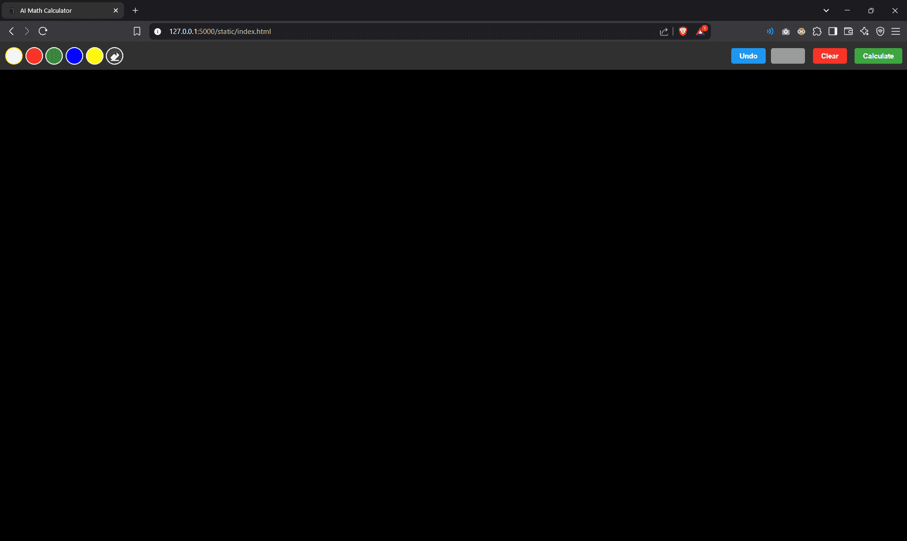
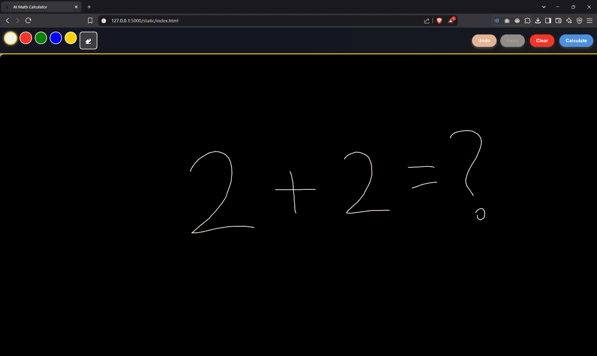
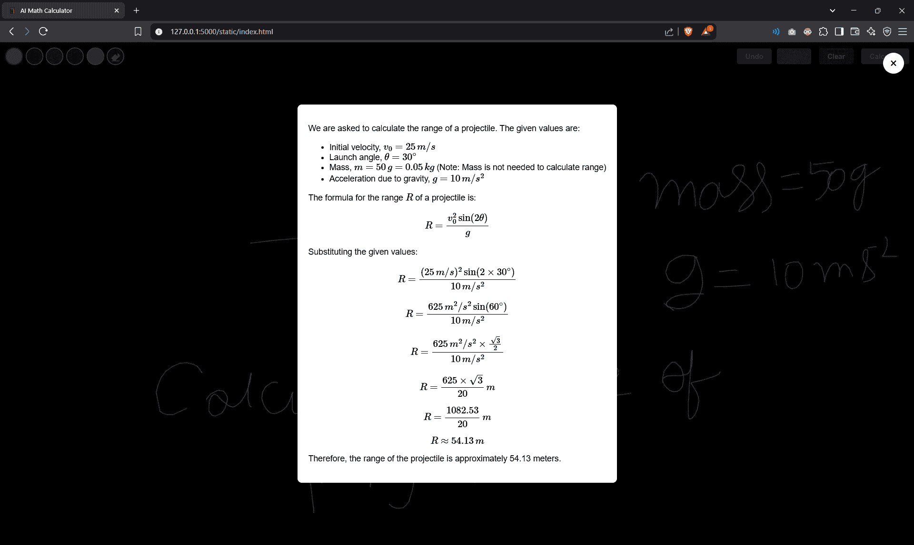

# AI Calculator

[](https://opensource.org/licenses/MIT)  
A modern AI-powered calculator app built with Flask and integrated with Google's Gemini API for advanced generative capabilities. This app supports any kind of mathematical calculations and provides a sleek, user-friendly interface.

## 🚀 Features
- **AI-Powered Calculations**: Leverages Google's Gemini API for advanced generative capabilities.
- **User-Friendly Design**: Intuitive UI with responsive design.
- **Error Handling**: Robust mechanisms for handling invalid inputs gracefully.
- **Static File Serving**: Includes a favicon and index page for a polished user experience.

---

## 🖼️ Screenshots
### Home Page


### Question


### Calculation Example


---

## 🛠️ Technologies Used
- **Backend**: Flask
- **Frontend**: HTML, CSS (Material Design principles)
- **API Integration**: Google's Gemini API
- **Environment Management**: Python `venv` and `dotenv`

---

## 📂 Project Structure
```plaintext
AI_Calculator/
├── app.py          # Main Flask application
├── static/         # Static files (favicon, index.html)
├── .env            # Environment variables
├── env/            # Python virtual environment
└── README.md       # Project documentation
```

---

## ✨ How It Works
1. **Input Handling**: Users can input numbers and operators via the web interface.
2. **AI-Powered Calculations**: The app uses Google's Gemini API for advanced generative calculations.

---

## ⚙️ Installation
1. Clone this repository:
   ```bash
   git clone https://github.com/arindam-tripathi/AI_Calculator.git
   cd AI_Calculator
   ```
2. Create a virtual environment and install dependencies:
   ```bash
   python -m venv env
   source env/bin/activate  # On Windows, use `env\Scripts\activate`
   pip install -r requirements.txt
   ```
3. Set up environment variables in the `.env` file (see below for details).
4. Run the Flask application:
   ```bash
   python app.py
   ```

---

## 📚 Setting Up the API Key
To use Google's Gemini API, you need an API key.

### 1. Get Your API Key
1. Go to [Google Cloud Console](https://console.cloud.google.com/).
2. Create a new project (or select an existing one).
3. Navigate to **APIs & Services** > **Credentials**.
4. Click on **Create Credentials** > **API Key**.
5. Copy the generated API key.

### 2. Configure the `.env` File
Create a `.env` file in the project root and add the following:
```plaintext
GEMINI_API_KEY=your_api_key_here
```
Replace `your_api_key_here` with the actual API key you obtained.

---

## 📚 Resources
- [Flask Documentation](https://flask.palletsprojects.com/)
- [Material Design Guidelines](https://material.io/design)
- [Google's Gemini API](https://cloud.google.com/gemini)

---

## 🧑‍💻 Contributing
Contributions are welcome! Feel free to open issues or submit pull requests.

---

## 📝 License
This project is licensed under the MIT License - see the [LICENSE](LICENSE) file for details.

---

## 📧 Contact
Created by [Arindam Tripathi](https://github.com/ArindamTripathi619).  
For any inquiries or suggestions, feel free to reach out!

### Social Links  
[](https://www.instagram.com/aritri619/)  [](https://www.facebook.com/arindam.tripathi.180/)  [](https://www.linkedin.com/in/arindam-tripathi-962551349/)  [](https://www.youtube.com/@arindamtripathi4602)  


---

